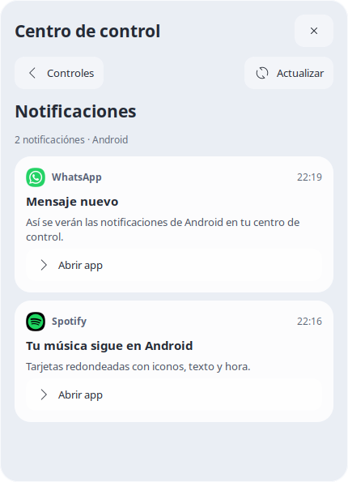

# Aplicaciones, Descargas y Centro de control

En la parte derecha del dock:

- **Aplicaciones** (carpeta azul con Android): cuadrícula y buscador. Android muestra solo los accesos elegidos, junto a las cinco apps principales de MacDesk.
- **Descargas** (carpeta azul con flecha): archivos recientes de `/sdcard/Download`, búsqueda y botón Abrir carpeta. Los archivos se abren con el visor nativo de Android usando MediaStore; los subdirectorios se abren en Files. Se muestran hasta 120 entradas recientes para limitar el trabajo al abrir el panel.
- **Centro de control** (icono de deslizadores): batería, volumen multimedia y brillo del teléfono, accesos a Wi-Fi/Bluetooth/Sonido/Pantalla de Android, modo oscuro, preferencias del dock y configuración de pantalla de MacDesk.

Para cambiar los accesos: Aplicaciones → Elegir apps de Android → marcar/desmarcar → Guardar. El botón Actualizar lista incorpora apps recién instaladas y actualiza sus iconos. Se puede buscar por nombre o paquete. Quitar todas limpia la selección; no desinstala aplicaciones.

Selección inicial: Canva, Chrome Beta (nombre que devuelve Android), Galería, Gmail, Maps y WhatsApp. El catálogo contiene 201 apps al instalar esta función; solo seis generan accesos de escritorio.

Los paneles se cierran con Escape, con la cruz o al pulsar fuera. Los accesos Android abren o recuperan las tareas nativas de Android; su ejecución sigue en Android/DeX. Las ventanas de Linux mantienen la gestión del dock existente.

Datos persistentes:

- `state/android-apps/catalog.json`, `icons/`: catálogo e iconos reales, sin consultas continuas.
- `state/android-apps/selected.json`: selección.
- `state/android-apps/adb-device`: dispositivo ADB preferido; usa la conexión inalámbrica ya configurada o el dispositivo local disponible.
- `state/desktop-hub.json`: modo oscuro seleccionado.
- `config/dock-hub/launchers/`: las tres entradas del dock, restauradas por `scripts/configure-docklike`.
- `scripts/macdesk-desktop-hub-setup`: regenera solo los accesos seleccionados al iniciar.

El puente `ANDROID` comparte el dispatcher existente con Linea Individual. Valida acciones, componentes de aplicaciones y rutas de Descargas; devuelve resultados por archivos JSON privados. El listado y los iconos se actualizan solo al pedirlo. GTK se inicia al abrir un panel y termina al cerrarlo.

Validación: pruebas del modelo (selección, retirada de accesos, rutas, orden y validación de controles); prueba GTK de búsqueda/selector/guardar/deslizadores/cuadrícula; catálogo y 201 iconos en el teléfono; apertura nativa de app y archivo nuevo indexado en MediaStore; cambio de tema; cierre al pulsar fuera; entradas .desktop válidas y dock a 12px del borde.

Además de la carpeta, el dock tiene accesos fijos a WhatsApp, Chrome, Samsung Internet y Spotify con iconos macOS. `scripts/macdesk-android-open` los resuelve por paquete contra el catálogo actual. Cambiar la selección de Aplicaciones no elimina estos cuatro accesos.

El dock y los iconos del escritorio comparten `scripts/dock-geometry-listener`: resize con debounce para el escritorio, strut inferior para identificar el dock y tamaños adaptados al ancho. Véase `docs/STABLE-BACKUP-2026-10-04.md` para restauración y resultados de pruebas.

## Notificaciones y apariencia global

Centro de control → **Notificaciones**: la misma tarjeta hace un giro horizontal
breve (340 ms) y muestra una lista de tarjetas inspiradas en One UI. **Controles**
regresa a los deslizadores; **Actualizar** obtiene una nueva instantánea. Cada
aviso muestra icono/nombre de app, título, mensaje y hora; **Abrir app** abre la
aplicación correspondiente, no una conversación o notificación específica.

Se usa el puente ADB existente, sin instalar un NotificationListenerService. Se
consulta el usuario actual y se leen como máximo 40 avisos, con tiempo de trabajo
limitado, filtrando otros perfiles. Las notificaciones marcadas sensibles por
Android muestran un texto protegido. Avisos sin texto ofrecen un placeholder;
las notificaciones que desaparecen durante la consulta se omiten. Una respuesta
parcial se indica en el panel. No se interceptan nuevos avisos ni se consulta en
segundo plano: la actualización ocurre al abrir esa cara o pulsar Actualizar.

Los mensajes no se escriben en los logs ni se incluyen en el respaldo. La respuesta
JSON privada se elimina al consumirla; si el cliente se cierra o abandona la
consulta, el productor la elimina 30 segundos después de escribirla. Esta es una
expiración puntual de la respuesta, sin servicio ni timer permanente. La animación
usa el frame clock de GTK y elimina su callback al terminar o cerrar la ventana.

**Modo oscuro · MacDesk y Android** cambia Android mediante `cmd uimode night`
y conserva el tema macOS GoldenGate claro/oscuro para GTK y XFWM, los iconos
BigSur/WhiteSur y el esquema de color de GNOME/GTK. Las aplicaciones que usan un
tema propio pueden conservarlo. Si una parte falla, se intenta restaurar la
apariencia anterior, incluido el modo automático/programado de Android, y se
muestra el error. La preferencia MacDesk se conserva al reiniciar.

**Ctrl+Alt+Espacio** abre/cierra Aplicaciones desde MacDesk. El atajo se registra
en XFCE; no se instala un interceptor de teclado Android. Ctrl+Espacio queda libre.
El setup de sesión recrea este atajo si está libre o ya pertenece a MacDesk, y
conserva cualquier acción distinta que el usuario haya asignado posteriormente.

Dependencia adicional para el giro: `python3-gi-cairo` (incluye `python3-cairo`).
Ya instalada en el Debian del teléfono; si falta al restaurar, el panel alterna
las caras sin animación y conserva sus funciones.

Validación 2026-10-04: 20 tests unitarios; prueba GTK aislada de giro/volver,
notificaciones, switch y cierre durante animación; prueba real de ambas
apariencias en Android/GTK/XFWM/GNOME, lectura y renderizado de 10 tarjetas durante
la prueba (el número cambia con las notificaciones activas), y apertura real de
Aplicaciones con Ctrl+Alt+Espacio. Se restauró la apariencia previa tras las pruebas.

Vista de referencia con contenido **sintético**, sin mensajes del teléfono:

Las horas de las tarjetas de notificaciones usan `America/Mexico_City`, independientemente de la zona horaria de Android o Linux.

El dock incluye también ChatGPT (`com.openai.chatgpt`), Chromium (`org.chromium.chrome`) y NewTermux (`com.termux`), con iconos del estilo macOS. Los accesos resuelven la actividad desde el catálogo instalado y reutilizan el puente Android.

## Iconos y actualización del escritorio

Los iconos fijos de Finder, Firefox, Terminal, Línea Individual, Aplicaciones, Descargas y Papelera se guardan en `assets/icons/dock/`. Usan rutas explícitas para evitar variantes pequeñas o iconos genéricos del tema al reiniciar. Se conservan los comandos y clases de ventana de cada aplicación. Los recursos de Finder, Firefox, Terminal, Descargas, Papelera y menú proceden de WhiteSur ya incluido en el repositorio; Línea Individual conserva su imagen local.

Desde una terminal dentro de MacDesk ejecuta `~/MacDesk-V6/scripts/macdesk-refresh-desktop` para actualizar. Comprueba el bus de sesión activo, recupera `xfwm4` o `xfdesktop` si faltan, aplica los iconos y solicita el reinicio normal del panel. No utiliza PIDs guardados ni reinicia la sesión XFCE completa.

Validación en DeX: escritorio y wallpaper recuperados, panel reiniciado con salida 0, `xfwm4` y `xfdesktop` permanecen activos y captura posterior revisada. Las capturas reales quedan localmente; no se publican porque pueden incluir ventanas personales.

El escritorio usa `MacDesk-Desktop` / `MacDesk-Desktop-dark`, un tema de iconos pequeño que hereda BigSur y WhiteSur. Sustituye los iconos nativos de disco, Home y papelera (vacía/llena) por Finder y papelera de WhiteSur, además de un disco metálico vectorial del mismo estilo que el dock, conservando posiciones, acciones y estados de XFCE. Se instala al arrancar y se conserva al alternar el modo oscuro global.

La actualización manual también recarga `xfsettingsd` para publicar el tema en GTK si el daemon anterior perdió su selección XSETTINGS. Se verificó la resolución real de los cuatro nombres de icono hacia `MacDesk-Desktop`, además de la captura del escritorio.
